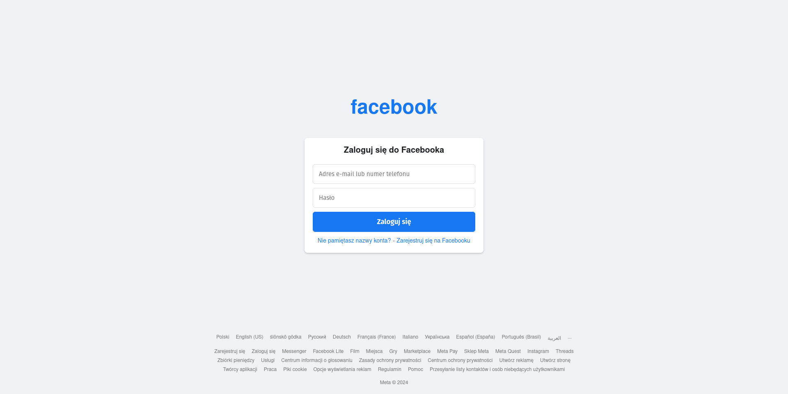

# Phishing Simulation Project

## Overview
This project is **a work in progress** and aims to simulate phishing attacks for **ethical and educational purposes only**. The key components include a fake website resembling a legitimate login page and a Python script for sending spoofed emails. This project can be used for testing security awareness in controlled environments.

---

## Project Structure
The project is organized as follows:
```
project/
│
├── modules/
│   ├── app.py           # Main Flask application for serving the phishing page
│   ├── send_email.py    # Script for sending spoofed emails
│
├── templates/
│   ├── index.html       # Fake login page template
│   ├── facebook.svg     # Facebook-like logo
│
├── main.py              # Entry point for running the project
├── logins.txt           # File for storing captured credentials (for testing purposes only)
├── README.md            # Project documentation
├── requirements.txt     # requirements for the project
└── .gitignore           # Ignored files
```

---

## Fake Login Page Preview
Below is an image preview of the current `index.html`, which mimics the Facebook login page for testing:



The login page collects entered credentials for **testing only**.


## Features

### 1. Fake Phishing Webpage
- **Clone-like Interface**: The `index.html` mimics a Facebook login page.
- **Credential Logging**: Credentials entered on the page are captured and stored locally in `logins.txt` for testing and awareness only.
- **Local Hosting**: Easily served with Flask, allowing you to analyze phishing behavior in a contained environment.

### 2. Email Spoofing (Testing)
- **Fake Emails**: Send emails that appear to come from reputable sources.
- **HTML Content**: Customize emails with HTML to simulate real phishing campaigns.
- **Local SMTP Debug**: Utilize a local SMTP debugging server to test and view the message output without sending actual emails to real users.

### 3. Ethical Emphasis
- **Clear Disclaimers**: The project provides explicit warnings against unauthorized usage.
- **Controlled Testing**: Intended for professionals to test their defensive strategies and raise security awareness among trained participants.

---

## Getting Started

### Prerequisites
- **Python 3.x**
- **Flask** for serving the phishing page
- **Local SMTP Debugging Server** (optional, for testing email functionality)
- **Ngrok** (optional, to expose local server externally if needed)

### Installation
1. **Clone the Repository**
   ```bash
   git clone https://github.com/Rskladanek/PhishSim-Toolkit/
   cd phishing-simulation
   ```

2. **Install Dependencies**
   ```bash
   pip install -r requirements.txt
   ```

3. **Run the Phishing Website**
   ```bash
   python3 modules/app.py
   ```
   Access the site locally at: `http://127.0.0.1:5000`

4. **Send Test Emails (Local Testing)**
   > Note: The included `send_email.py` script is configured to work with a local SMTP debugging server. This allows you to test the appearance and structure of spoofed emails without delivering them to real inboxes.

   - **Start a Local SMTP Debugging Server**
     In a separate terminal, run:
     ```bash
     python3 -m smtpd -c DebuggingServer -n localhost:1025
     ```
     This will display any received emails on the terminal without sending them.

   - **Send a Test Email**
     ```bash
     python3 modules/send_email.py
     ```
     You should see the email output in the SMTP debugging server’s terminal.

5. **Test the Full Workflow**
   - **Set up Ngrok (Optional)**
     If you want to test the phishing page externally (e.g., from another device), use Ngrok:
     ```bash
     ngrok http 5000
     ```
     Ngrok will provide a public URL that tunnels to your local server.

   - **Check the Fake Login Page**
     Visit the Ngrok URL or `http://127.0.0.1:5000` locally.
     Enter credentials to see them logged in `logins.txt` (test environment only).

   - **Review the Logged Credentials**
     Open `logins.txt` to see the captured data and understand how phishing works.

---

## Legal and Ethical Considerations
- **For Educational Use Only**: Never use this tool without explicit written consent from all relevant parties.
- **Comply with Laws**: Familiarize yourself with applicable laws and regulations.
- **Respect Privacy**: Do not capture, store, or share real credentials without authorization.

> **If in doubt, do not use this tool.**

---

## Status and Next Steps

### Current Status:
- ✅ Basic phishing page: Implemented
- ✅ Email spoofing script: Test environment ready (no real delivery)

### Next Steps:
1. Enhance UI/UX of the phishing page.
2. Add additional logging and security features.
3. Integrate a real SMTP solution with necessary authentication (if ethically permissible).

---

## Contributions
Contributions are welcome to improve the code, documentation, and security features. Please open an issue or submit a pull request.

---

## Download
You can clone the repository directly from GitHub:
```bash
git clone https://github.com/your-username/phishing-simulation.git
```

---

## Final Disclaimer
Use of this project is at your own risk. This is intended solely for legitimate and ethical security testing, research, and educational purposes.
